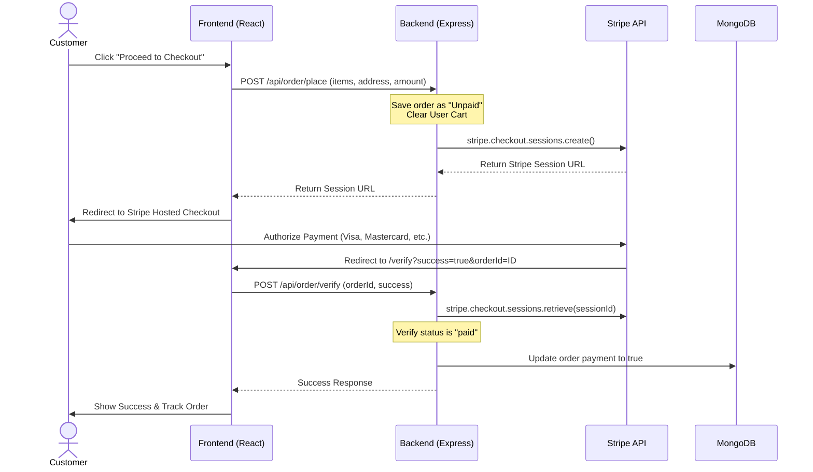

# Tomato 🍅 - Premium Full Stack Food Delivery App

Tomato is a premium, full-stack food delivery application built using the MERN stack (MongoDB, Express, React, Node.js). It offers a complete customer ordering experience, secure payment flow via Stripe, dynamic search, live delivery tracking, and a dedicated admin portal for store owners to manage food listings and orders.

---

## 🚀 Key Features

### 🛒 Customer Portal
- **Modern & Dynamic UI/UX**: Built with Vanilla CSS for full control, featuring smooth transitions, hover effects, and micro-animations.
- **Dynamic Food Search**: Search and filter dishes by name or description in real-time straight from the navbar.
- **Cart Management**: Add, modify, or remove items with instant cart calculation.
- **Stripe Checkout Integration**: Seamless, secure card processing via Stripe-hosted checkout sessions.
- **Live Order Tracking**:
  - Clear timeline showing the order stages: *Food Processing* ➔ *Out for Delivery* ➔ *Delivered*.
  - Fun animations: Sizzling cooking pan for preparation, and a moving delivery bike along a road for transit.
  - Quick refresh indicators to fetch real-time updates.
- **Payment Retry Flow**: If checkout is cancelled or fails, the order is saved as "Unpaid" under **My Orders** so customers can click **Pay Now** to retry payment directly.

### 💼 Administration Dashboard
- **Product Management**: Add new food items with images, assign categories, list existing items, and delete outdated ones.
- **Order Dispatch Control**: View all customer orders, see items, and update order statuses dynamically.

### 🛠️ Core Infrastructure & Windows Development Enhancements
- **Auto-create Storage Folder**: The backend automatically initializes the `uploads` directory on start if it is missing, preventing upload crashes.
- **Windows DNS Resolution Helper**: Includes custom Node.js DNS setup (`dns.setServers`) to resolve Atlas MONGODB connection problems seamlessly in local Windows environments.
- **Vercel Deploy Compatibility**: Pre-configured routes (`vercel.json` rewrite rules) for deploying both the Frontend single-page React app and the Backend Express server correctly.

---

## 🛠️ Tech Stack

- **Frontend**: React (Vite), React Router DOM, Axios, Context API
- **Backend**: Node.js, Express, Stripe API, JWT Authentication, Multer (for image uploads)
- **Database**: MongoDB (Atlas) with Mongoose
- **Deployment**: Vercel

---

## 📦 Project Structure

```
├── [admin/](./admin)       # React administration dashboard
├── [backend/](./backend)     # Express API, MongoDB models, controller logic
└── [frontend/](./frontend)    # React customer portal
```

---

## 🖥️ Application Pages & Modules

### 🛒 Frontend Pages (Customer Portal)
- **Home (`/`) - [Home.jsx](./frontend/src/pages/Home/Home.jsx)**: 
  - Dynamic category selector featuring interactive transitions to filter the menu.
  - Live food list showcasing descriptions, pricing, and visual food items.
  - Cart counters embedded inside food item cards for quick adding/removing.
  - Global real-time search bar integrated within the navbar header.
- **Cart (`/cart`) - [Cart.jsx](./frontend/src/pages/Cart/Cart.jsx)**: 
  - Summarizes ordered items, item quantities, and item-specific costs.
  - Dynamic checkout calculations including subtotal, flat delivery fee, and grand total.
  - User authorization checker directing guest users to log in before checking out.
- **Place Order (`/order`) - [PlaceOrder.jsx](./frontend/src/pages/PlaceOrder/PlaceOrder.jsx)**: 
  - Checkout form capturing delivery address details (Name, Address, Phone, etc.).
  - Action button that processes the cart details, communicates with Stripe API, and redirects user to checkout.
- **Verify Payment (`/verify`) - [Verify.jsx](./frontend/src/pages/Verify/Verify.jsx)**: 
  - A loading spinner landing page that processes the Stripe redirection callback.
  - Extracts the URL query parameters `success` and `orderId`, and fires verification request to the backend.
- **My Orders (`/myorders`) - [MyOrders.jsx](./frontend/src/pages/MyOrders/MyOrders.jsx)**: 
  - Shows order history with list of purchased items, prices, and status.
  - **Live Status Tracker**: A progress bar visualization (Food Processing ➔ Out for Delivery ➔ Delivered).
  - **Payment Retry**: "Pay Now" link for unpaid orders to re-trigger a Stripe Session.

### 💼 Admin Portal Pages
- **Add Product (`/add`) - [Add.jsx](./admin/src/pages/Add/Add.jsx)**: 
  - Form to upload an image of the dish, name, description, price, and select its category from a dropdown.
- **List Products (`/list`) - [List.jsx](./admin/src/pages/List/List.jsx)**: 
  - Renders all products registered in the database in a table with product image, name, category, price, and a delete control.
- **Manage Orders (`/orders`) - [Orders.jsx](./admin/src/pages/Orders/Orders.jsx)**: 
  - Order dashboard displays order content details, delivery address, phone, item quantities, price, and status.
  - Includes a dropdown selector to update the order status in real-time.

### ⚙️ Backend Architecture & Flow
- **[server.js](./backend/server.js)**: Core entry point. Initialized with Express, CORS, and JSON parser middleware. Mounts all API routers and exposes static `/images` endpoint pointing to the dynamic `uploads/` directory.
- **Database ([models/](./backend/models))**: 
  - **[foodModel.js](./backend/models/foodModel.js)**: Schema mapping name, description, price, image, and category.
  - **[userModel.js](./backend/models/userModel.js)**: Schema mapping user name, email, password, and shopping cart dictionary (`cartData`).
  - **[orderModel.js](./backend/models/orderModel.js)**: Schema tracking order items, amount, delivery address, payment status, status history, and Stripe `sessionId`.
- **Middleware ([middleware/](./backend/middleware))**:
  - **[auth.js](./backend/middleware/auth.js)**: Inspects headers for a JWT token, decodes and verifies it, and attaches the user's database ID to `req.userId` for downstream routes.
- **Controllers ([controllers/](./backend/controllers)) & Routing ([routes/](./backend/routes))**:
  - Modular controller and routing files separating processing logic from Express endpoints:
    - **Food**: [foodController.js](./backend/controllers/foodController.js) & [foodRoute.js](./backend/routes/foodRoute.js)
    - **User**: [userController.js](./backend/controllers/userController.js) & [userRoute.js](./backend/routes/userRoute.js)
    - **Cart**: [cartController.js](./backend/controllers/cartController.js) & [cartRoute.js](./backend/routes/cartRoute.js)
    - **Order**: [oderController.js](./backend/controllers/oderController.js) (Note the filename spelling) & [orderRoute.js](./backend/routes/orderRoute.js)

---

## ⚙️ Getting Started

### Prerequisites
- Node.js installed on your machine.
- A MongoDB Atlas account or local MongoDB instance.
- Stripe account API keys.

---

### Installation & Local Setup

#### 1. Clone the repository
```bash
git clone https://github.com/Sg-2003/Food-del.git
cd Food-del
```

#### 2. Backend Setup
1. Navigate to the `backend/` directory:
   ```bash
   cd backend
   ```
2. Create a `.env` file in the root of the `backend/` folder:
   ```env
   JWT_SECRET="your_jwt_secret"
   STRIPE_SECRET_KEY="your_stripe_test_secret_key"
   FRONTEND_URL="http://localhost:5173"
   MONGODB_URI="your_mongodb_connection_string"
   ```
3. Install dependencies and start the local server:
   ```bash
   npm install
   npm run server
   ```
   *The server starts on http://localhost:4000.*

#### 3. Frontend Setup
1. Navigate to the `frontend/` directory:
   ```bash
   cd ../frontend
   ```
2. Install dependencies:
   ```bash
   npm install
   ```
3. Run the development server:
   ```bash
   npm run dev
   ```

#### 4. Admin Dashboard Setup
1. Navigate to the `admin/` directory:
   ```bash
   cd ../admin
   ```
2. Install dependencies:
   ```bash
   npm install
   ```
3. Run the admin portal:
   ```bash
   npm run dev
   ```

## 💳 Stripe Payment Gateway Integration

Tomato features a secure end-to-end payment processing flow using the official **Stripe API**.

### 🔄 The Checkout & Verification Flow



### 🛠️ Key Integration Details
1. **Dynamic Line Items**: The backend constructs an array of line items from the user's cart, converting the USD prices into cents (multiplied by `100`) as required by Stripe.
2. **Delivery Fee Injection**: A flat delivery charge of `$2.00` is automatically appended to the Stripe transaction session as a standalone line item.
3. **Session ID Tracking**: The generated `sessionId` is stored in the MongoDB order document to allow verification during the callback.
4. **Secure Verification**: When the customer is redirected to the `/verify` page, the backend fetches the session from Stripe via `stripe.checkout.sessions.retrieve` to inspect the `payment_status === "paid"` server-to-server.
5. **Payment Retry Option**: For orders where checkout was cancelled or failed, the user's cart is not lost and the order remains registered as unpaid. The customer can retry payment from the **My Orders** screen, which requests `/api/order/pay` to generate a new Stripe session link for that specific order.
6. **Graceful Developer Fallback (Mock Mode)**: If no Stripe secret key is supplied or Stripe fails to reach servers, the code falls back to generating a mock session token `mock_session_<order_id>` and redirects the developer straight to the verification success path, enabling seamless offline local testing.

---

## 📡 API Endpoint Reference

All backend API paths are prefixed with `/api`.

### 🍔 Food Endpoints (`/api/food`)
- `POST /add` - Upload a new food item (Accepts `multipart/form-data` with fields: `name`, `description`, `price`, `category`, and file `image`).
- `GET /list` - Fetch all food items.
- `POST /remove` - Delete a food item (Accepts JSON body: `{ "id": "food_id" }`).

### 👤 User Endpoints (`/api/user`)
- `POST /register` - Register a new account (Accepts: `{ "name", "email", "password" }`).
- `POST /login` - User login (Accepts: `{ "email", "password" }`). Returns JWT Token.

### 🛒 Cart Endpoints (`/api/cart`)
*Requires `token` header for authorization.*
- `POST /add` - Add item to cart (Accepts JSON body: `{ "itemId": "food_id" }`).
- `POST /remove` - Remove item from cart (Accepts JSON body: `{ "itemId": "food_id" }`).
- `POST /get` - Retrieve all items in the user's cart.

### 💳 Order Endpoints (`/api/order`)
- `POST /place` - Create an order and generate Stripe session URL (*Auth Required*; Accepts: `{ "items", "amount", "address" }`).
- `POST /verify` - Verify Stripe session payment completion (Accepts: `{ "orderId", "success" }`).
- `GET /list` - Retrieve all orders across the system (For Admin).
- `POST /status` - Update status of an order (For Admin; Accepts: `{ "orderId", "status" }`).
- `POST /userorders` - Retrieve list of orders placed by the current user (*Auth Required*).
- `POST /pay` - Regenerate Stripe payment session url for a previously failed/unpaid order (*Auth Required*; Accepts: `{ "orderId" }`).

---

## 🚀 Deployment

### Backend on Vercel
Deploy the backend server configuration defined in `backend/vercel.json`:
- Make sure to add the environment variables in your Vercel Project Dashboard corresponding to `JWT_SECRET`, `STRIPE_SECRET_KEY`, `MONGODB_URI`, and `FRONTEND_URL`.
- Build command: *leave empty*
- Output directory: *leave empty*

### Frontend & Admin on Vercel
Deploy static SPA React apps using rewrite rules defined in `frontend/vercel.json` to handle client-side routing.
- Set the backend URL variable accordingly.
- Build command: `npm run build`
- Output directory: `dist`
